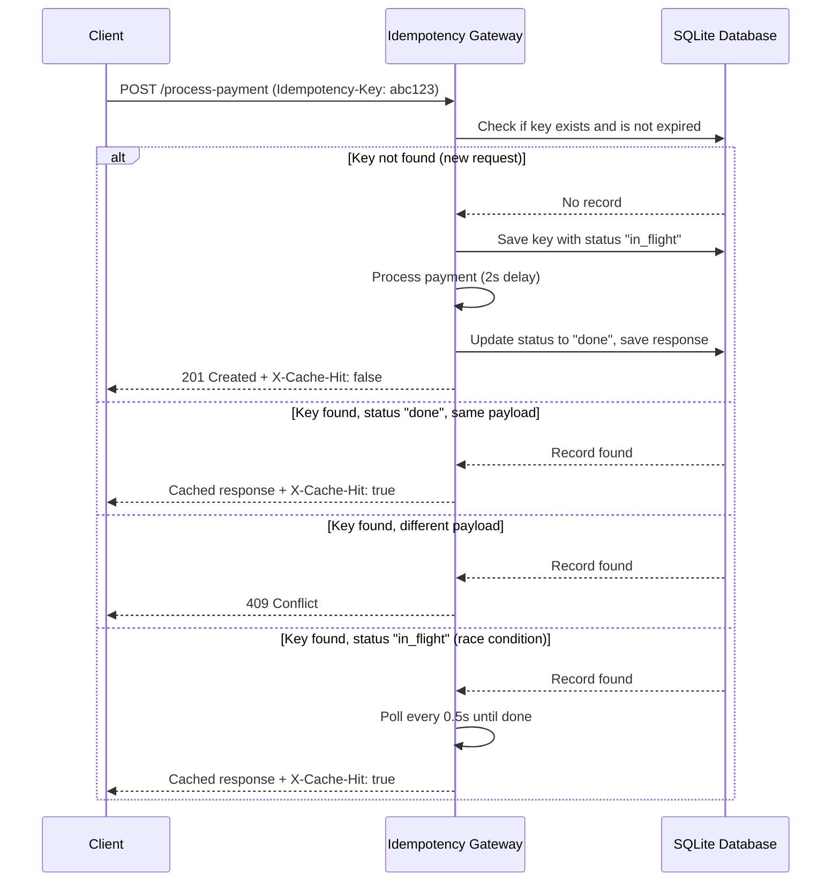

# Idempotency Gateway

A RESTful API middleware that ensures payment requests are processed **exactly once**, preventing double-charging caused by network timeouts and retries.

Built with **Python**, **FastAPI**, and **SQLite**.

---

## Table of Contents

- [Architecture](#architecture)
- [Setup Instructions](#setup-instructions)
- [API Documentation](#api-documentation)
- [Design Decisions](#design-decisions)
- [Developer's Choice: Key Expiry](#developers-choice-key-expiry)
- [Running the API](#running-the-api)

---

## Architecture

The system works as a middleware layer between the client and the payment processor. Every request passes through the idempotency check before any processing occurs.



---

## Setup Instructions

### Prerequisites

- Python 3.11+
- Conda (recommended) or pip

### Installation

1. **Clone the repository**

```bash
git clone https://github.com/Isaacpro17/idempotency-gateway.git
cd idempotency-gateway
```

2. **Create and activate the Conda environment**

```bash
conda create -n idempotency-gateway python=3.11
conda activate idempotency-gateway
```

3. **Install dependencies**

```bash
pip install -r requirements.txt
```

### Running the Server

```bash
uvicorn app.main:app --reload
```

- Server runs at: **http://127.0.0.1:8000**
- Interactive API docs at: **http://127.0.0.1:8000/docs**

### 🌐 Live Deployment

The API is fully deployed and accessible without any local setup:

| Interface | URL |
|-----------|-----|
| Live API | https://idempotency-gateway-cyw6.onrender.com |
| Live Swagger Docs | https://idempotency-gateway-cyw6.onrender.com/docs |
| Live ReDoc | https://idempotency-gateway-cyw6.onrender.com/redoc |

---

## API Documentation

### Endpoint 1: Health Check

**`GET /`**

Confirms the server is running.

**Response `200 OK`:**
```json
{
  "status": "ok",
  "message": "Idempotency Gateway is running"
}
```

---

### Endpoint 2: Process Payment

**`POST /process-payment`**

| Part | Detail |
|------|--------|
| Method | `POST` |
| URL | `/process-payment` |
| Required Header | `Idempotency-Key: <unique-string>` |
| Content-Type | `application/json` |

**Request Body:**
```json
{
  "amount": 100,
  "currency": "GHS"
}
```

---

#### Case 1 — First Request (Happy Path)

New key, payment is processed.

```bash
curl -X POST http://127.0.0.1:8000/process-payment \
  -H "Content-Type: application/json" \
  -H "Idempotency-Key: unique-key-001" \
  -d '{"amount": 100, "currency": "GHS"}'
```

**Response `201 Created`:**
```json
{
  "message": "Charged 100.0 GHS",
  "idempotency_key": "unique-key-001"
}
```
Header: `X-Cache-Hit: false`

---

#### Case 2 — Duplicate Request (Idempotency)

Same key, same payload — returns cached response instantly, no processing.

```bash
curl -X POST http://127.0.0.1:8000/process-payment \
  -H "Content-Type: application/json" \
  -H "Idempotency-Key: unique-key-001" \
  -d '{"amount": 100, "currency": "GHS"}'
```

**Response `201 Created`:**
```json
{
  "message": "Charged 100.0 GHS",
  "idempotency_key": "unique-key-001"
}
```
Header: `X-Cache-Hit: true`

---

#### Case 3 — Same Key, Different Payload (Conflict)

Same key reused with a different amount — rejected to protect data integrity.

```bash
curl -X POST http://127.0.0.1:8000/process-payment \
  -H "Content-Type: application/json" \
  -H "Idempotency-Key: unique-key-001" \
  -d '{"amount": 500, "currency": "GHS"}'
```

**Response `409 Conflict`:**
```json
{
  "message": "Idempotency key already used for a different request body."
}
```

---

#### Case 4 — Missing Header

```bash
curl -X POST http://127.0.0.1:8000/process-payment \
  -H "Content-Type: application/json" \
  -d '{"amount": 100, "currency": "GHS"}'
```

**Response `400 Bad Request`:**
```json
{
  "message": "Idempotency-Key header is required"
}
```

---

## Design Decisions

### Why FastAPI?
FastAPI provides native `async/await` support which is essential for a payment gateway that must handle concurrent requests efficiently. It also auto-generates interactive OpenAPI documentation at `/docs`, making the API easy to explore and test.

### Why SQLite with aiosqlite?
SQLite requires no external database server, making the project easy to clone and run immediately. `aiosqlite` wraps SQLite with async support so database queries never block the event loop. For this scale of middleware, SQLite is the perfect fit.

### Why asyncio Locks?
When two identical requests arrive at the exact same time, we need to prevent both from being processed simultaneously. Python's `asyncio.Lock()` solves this without needing Redis or any external locking system — keeping the stack simple and self-contained.

### Why the Lock is Released Before Processing?
The lock is held **only** during the quick database read and the `"in_flight"` write. It is released before the 2-second payment processing delay. This is a critical design decision — holding the lock during processing would cause a deadlock where Request B waits for the lock, but Request A can never finish because it needs the lock to save its result.

---

## Developer's Choice: Key Expiry

**Feature: Idempotency Key Expiry (24-hour TTL)**

### The Problem
Without expiry, idempotency keys live in the database forever. This means:
- A key used 6 months ago could accidentally block a new legitimate payment
- The database grows indefinitely with no cleanup
- It does not reflect how real payment systems work

### The Implementation
The `check_idempotency()` function filters records using SQLite's `datetime('now', '-24 hours')`:

```sql
SELECT * FROM idempotency_keys 
WHERE key = ? 
AND created_at >= datetime('now', '-24 hours')
```

The `save_initial_request()` function uses `INSERT OR REPLACE` so that when an expired key is reused, it is cleanly replaced with a fresh record instead of causing a conflict error.

A database index on `created_at` was also added for query performance:

```sql
CREATE INDEX IF NOT EXISTS idx_created_at ON idempotency_keys(created_at)
```

### Why It Matters
This mirrors how real payment processors like **Stripe** implement idempotency — keys expire after 24 hours. It prevents database bloat, allows legitimate retries after the expiry window, and makes the system production-ready.

---

## Project Structure

```
idempotency-gateway/
├── app/
│   ├── __init__.py        # Package initializer
│   ├── main.py            # FastAPI app entry point
│   ├── database.py        # SQLite schema and connection
│   ├── models.py          # Pydantic request/response models
│   ├── idempotency.py     # Core idempotency logic
│   └── routes.py          # API endpoint definitions
├── requirements.txt       # Project dependencies
└── README.md              # Project documentation
```

---

## Tech Stack

| Technology | Purpose |
|------------|---------|
| Python 3.11 | Core language |
| FastAPI | Web framework |
| uvicorn | ASGI server |
| aiosqlite | Async SQLite driver |
| SQLite | Database |
| asyncio | Race condition handling |
| httpx | HTTP testing client |
